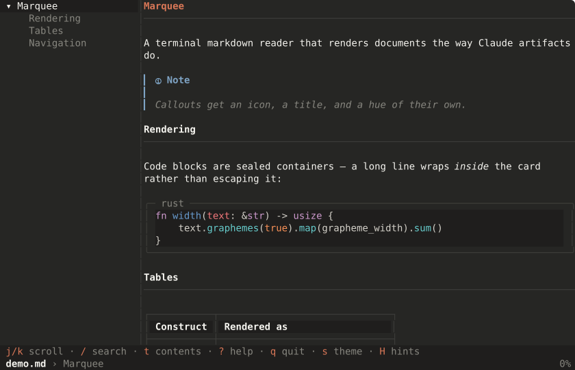

<h1 align="center">marquee-markdown</h1>

<p align="center">
  A terminal markdown reader with the functionality of
  <a href="https://github.com/charmbracelet/glow"><code>glow</code></a>,
  rendering documents the way Claude artifacts do —<br>
  a centered reading column on a painted page, typographic headings, sealed
  code cards — with a table-of-contents panel for navigation.
</p>

<p align="center">
  <a href="https://github.com/SophanaSok/marquee-markdown/actions/workflows/ci.yml"></a>
  <a href="https://crates.io/crates/marquee-markdown"></a>
  
  <a href="LICENSE"></a>
  
</p>

<p align="center">
  
</p>

<p align="center"><sub>
  Real output, not a mock-up — regenerate it with
  <code>python3 scripts/screenshot.py</code>.
</sub></p>

> **Status: 0.1.0 is out.** Everything documented here works today. See
> [docs/ROADMAP.md](docs/ROADMAP.md) for what is planned before 1.0.

## What it does

- **Reads markdown properly.** Headings become typography rather than hash
  marks, code blocks become sealed cards, tables get box drawing, and GFM
  callouts get an icon and a hue.
- **A contents pane that tracks where you are**, with folding — the thing
  `glow` has no equivalent of, and the reason this exists.
- **Search inside a document** with `/`, `n` and `N`, highlighted in place.
- **A file browser** that streams as it walks, with a fuzzy filter.
- **Reads what you point it at**: a file, a directory, standard input, a URL,
  or `github.com/owner/repo`.
- **Reloads when you save**, and `e` opens your editor at the line on screen.
- **Everything is configurable and every key is rebindable**, from one TOML
  file.
- **Themes are data**, so a new palette needs no Rust and no recompile.

## Why not glow

`glow` is good, and this keeps its flags and its keys so muscle memory carries
over. But rendering the same document through glow 3.0.0 shows what this fixes:

| glow | marquee-markdown |
| --- | --- |
| `## Heading` — hash marks reach the output | typography: weight, color, rhythm, a hairline rule |
| Blockquotes prefixed with ASCII `\|` | an accent `▎` gutter bar |
| `[!NOTE]` printed literally | an icon-and-title callout in its own hue |
| Tables with no border, bare `---\|---` | box drawing with a shaded header band |
| Thematic breaks as `--------` | a hairline `─` across the column |
| Long code lines wrap *out* of the block | they stay sealed inside the card |
| OSC 8 escapes counted as width, leaving ragged lines | escapes cannot reach width math |
| 2-space margin | a centered reading column, page painted edge to edge |
| No outline, no in-document search | a scroll-tracking contents pane, and `/` `n` `N` |
| Keys hardcoded, cannot be rebound | every key resolves through a rebindable action table |

The last two rows are the ones that made this worth building. The rest are
rendering details that add up.

## Install

### With cargo

```sh
cargo install marquee-markdown
```

Needs Rust 1.88 or newer — the code uses let-chains, which that release
stabilized for the 2024 edition. Nothing else: syntax highlighting uses a
pure-Rust regex backend on purpose, so there is no C toolchain and no system
library to find.

That installs two commands: **`marquee-markdown`** and **`mmd`**, which are the
same program under a shorter name.

### Prebuilt

Each [GitHub release](https://github.com/SophanaSok/marquee-markdown/releases)
carries binaries for Linux, macOS (Intel and Apple Silicon) and Windows, plus
`.deb` and `.rpm` packages, with man pages and shell completions in the
archives and SHA-256 checksums alongside.

```sh
# Debian and derivatives
sudo dpkg -i marquee-markdown_0.1.0-1_amd64.deb

# Fedora and derivatives
sudo rpm -i marquee-markdown-0.1.0-1.x86_64.rpm
```

Homebrew and Scoop manifests live in [`packaging/`](packaging/); there is no
tap or bucket yet.

### From source

```sh
git clone https://github.com/SophanaSok/marquee-markdown
cd marquee-markdown
cargo install --path .
```

### Fonts

Any monospace font works. A [Nerd Font](https://www.nerdfonts.com/) additionally
gives you the icons on callouts and images; without one those show as a missing
glyph, and everything else is unaffected.

## Contents

[Usage](#usage) · [Reading](#reading) · [Browsing](#browsing) ·
[Editing, reloading, copying](#editing-reloading-and-copying) ·
[Remote documents](#remote-documents) · [Configuration](#configuration) ·
[Themes](#themes) · [As a library](#using-the-renderer-as-a-library) ·
[Contributing](#contributing)

## Usage

Everything below works with `mmd` too — it is the same program under a shorter
name, which is the one you will actually type.

```sh
mmd                                 # browse the markdown here
mmd README.md                       # render a file
mmd -t README.md                    # ...in the full-screen reader

marquee-markdown                    # browse the markdown here
marquee-markdown README.md          # render a file
marquee-markdown docs/              # render a directory's README
marquee-markdown -                  # read standard input
cat notes.md | marquee-markdown     # same
marquee-markdown src/main.rs        # source files render as highlighted code

marquee-markdown github.com/charmbracelet/glow   # a repository's README
marquee-markdown gitlab://gitlab-org/gitlab      # the same, spelled as a scheme
marquee-markdown https://example.com/doc.md      # any URL

marquee-markdown -t doc.md          # full-screen reader
marquee-markdown -w 80 doc.md       # fixed width (0 disables wrapping)
marquee-markdown -s paper doc.md    # light theme
marquee-markdown -l doc.md          # line numbers

marquee-markdown -p doc.md          # through your pager
marquee-markdown themes             # list available themes
marquee-markdown config             # the settings in force
marquee-markdown keys               # every key binding
marquee-markdown man                # man page to stdout
marquee-markdown completion fish    # shell completions
```

Standard input is read when nothing else is named, or when `-` asks for it. A
named source always wins — unlike glow, where a redirected stdin silently
replaces the file you asked for, which is fine when you typed the pipe and
wrong in a cron job.

Output degrades on its own: piping or redirecting drops color, gutters, and
hyperlinks, so `marquee-markdown doc.md > out.txt` contains just the text, and
closing the pipe early (`… | head`) stops quietly rather than erroring.
`NO_COLOR` is honored.

Every flag `glow` takes is accepted and means the same thing:
`-a -l -m -n -p -s -t -w`.

## Reading

`-t` opens the full-screen reader: the document in a centered column, a
table-of-contents pane beside it, and a status bar that says where you are.
Keys follow glow, so muscle memory carries over; `?` shows the list, rendered
from the keymap that is actually in force rather than from a fixed page, so it
stays honest once keys become rebindable.

Keys are written here the way a configuration file will spell them.

| Key | |
| --- | --- |
| `j` `k` · `down` `up` | line down, line up |
| `d` `u` · `ctrl+d` `ctrl+u` | half page down, half page up |
| `f` `b` · `space` `pgdn` `pgup` | page down, page up |
| `g` `G` · `home` `end` | top, bottom |
| `h` `l` · `left` `right` | scroll sideways (only with `-w 0`) |
| `/` | search |
| `n` `N` | next hit, previous hit |
| `]` `[` | next link, previous link |
| `enter` | open the selected link |
| `y` | copy the selected link |
| `c` | copy the document |
| `e` | edit, at the line on screen |
| `r` | reload from disk |
| `t` | show / hide the contents pane |
| `tab` | move focus between the panes |
| `T` | switch light / dark |
| `?` | key reference |
| `ctrl+z` | suspend to the shell (unix) |
| `esc` | close what is open |
| `q` · `ctrl+c` | quit |

The contents pane takes the same movement keys, pointed at itself. `h` and `l`
fold and unfold there, which is what they mean in any tree; in the document
they still scroll sideways.

| Key | |
| --- | --- |
| `j` `k` · `down` `up` | next entry, previous entry |
| `g` `G` · `home` `end` | first entry, last entry |
| `h` `l` · `left` `right` | fold, unfold |
| `enter` | go to the entry |
| `tab` · `esc` | back to the document |

The pane highlights two different things and they are deliberately not the
same: the **active** entry is the section the document is scrolled to, and it
follows you as you read, while the **cursor** is where you left it. Scrolling
never drags the cursor away mid-keystroke. The pane hides itself on a narrow
terminal, and on a document with fewer than two headings, where it would cost
a quarter of the screen to say nothing.

## Browsing

Run `marquee-markdown` with no argument, or point it at a directory, and it
lists the markdown under it — most recently edited first, with hidden and
git-ignored files left out unless `-a` says otherwise. The walk streams, so the
first screenful is there immediately and a large tree fills in behind it.

| Key | |
| --- | --- |
| `j` `k` · `down` `up` | next file, previous file |
| `f` `d` · `l` `right` `pgdn` | next page |
| `b` `u` · `h` `left` `pgup` | previous page |
| `g` `G` · `home` `end` | first file, last file |
| `enter` | read this file |
| `/` | filter the list |
| `r` | rescan the directory |
| `.` | show / hide hidden and ignored files |
| `esc` | clear the filter |
| `q` · `ctrl+c` | quit |

`esc` in a document goes back to the list, so the browser is where a reading
session lives rather than somewhere you pass through once. The list is a
snapshot; `r` walks the directory again — keeping your filter and, when the
file still exists, your place — and `.` widens or narrows the walk to hidden
and git-ignored files on the spot.

Two of those keys are inconsistent with the document: `f`/`d` page a whole
screen here and half a screen when reading, and `h`/`l` page here but scroll
sideways there. That is glow's behavior, reproduced deliberately — anyone with
the muscle memory would find a silent correction more surprising than the
quirk, and rebindable keys are the fix glow cannot offer.

The filter is fuzzy and runs as you type: `rdmp` finds `docs/ROADMAP.md`. Both
the query and the file names are normalized first, so a name written with
combining marks still matches one typed with precomposed characters — a file
you can see should never be a file you cannot find.

Search runs over the rendered text, so a hit is already a place on the page and
highlighting costs nothing. A lowercase query ignores case; a query with any
capital in it does not. `esc` clears the highlight. One consequence of
searching what is on screen: a phrase broken across a soft wrap will not match,
because on the page it genuinely is two lines.

## Editing, reloading, and copying

The open document is watched, so saving it in another window re-renders it
where you are — the *section* you were reading, not the line number, which an
edit above you would have moved. `r` reloads by hand if a filesystem does not
report changes.

`e` opens the document in `$VISUAL`, `$EDITOR`, or `vi`, at the line on screen,
and reloads when the editor exits. Line arguments are spelled the way each
editor wants them; an editor that is not recognized is handed the path alone
rather than a flag it would take for a second filename.

`c` copies the markdown as written, not as rendered — what you want to paste
elsewhere is the source. `y` copies the address of the selected link. Both go
through the terminal (OSC 52) before the system clipboard, so copying works
over SSH: the text lands on the machine you are sitting at rather than on the
server. In tmux this needs `set -g set-clipboard on`.

Resizing the terminal or switching theme re-lays out the document and keeps
your place: the position is carried by source offset, not by line number, so a
narrower column does not teleport you. Search hits are re-found at the same
time, so the highlight never points at a stale line.

## Remote documents

A repository shorthand resolves through the forge's API to the raw README, so
what you get is the file rather than a screenful of the page around it:

```sh
marquee-markdown github.com/charmbracelet/glow
marquee-markdown github://charmbracelet/glow      # same thing
marquee-markdown gitlab://gitlab-org/gitlab
marquee-markdown https://example.com/notes/guide.md
```

The extension in a URL is trusted ahead of the `Content-Type` header, because
plenty of servers hand out markdown as `text/plain` or even `text/html`, and a
`.md` in the path is a stronger statement of intent than a header nobody
thought about. A URL with no extension served as HTML is shown as highlighted
markup rather than run through the markdown renderer, which would only produce
noise.

Fetched documents are capped at 8 MiB and time out after 20 seconds, so a
mistyped URL cannot leave you with an unresponsive terminal.

## Configuration

Nothing needs configuring, but everything can be. The file lives at
`~/.config/marquee-markdown/config.toml`; `--config` or `MARQUEE_CONFIG` names
a different one.

```toml
[general]
style = "paper"            # theme name or path to a theme file
width = 80                 # 0 disables wrapping
line-numbers = false
mouse = false
all = false                # list hidden and ignored files when browsing
preserve-new-lines = false

[ui]
contents = true            # start with the contents pane showing

[keys.document]
"ctrl+n" = "line-down"     # rebind
"q" = "none"               # or take a key away
```

Settings resolve in one order, everywhere: **command line, then environment,
then file, then defaults**. A flag that was not given contributes nothing, so
`mouse = true` in your config is not undone by every invocation that omits
`-m`.

Environment variables are the setting name in `MARQUEE_` form, with
`[general]` left out: `MARQUEE_STYLE`, `MARQUEE_WIDTH`, `MARQUEE_LINE_NUMBERS`,
`MARQUEE_MOUSE`, `MARQUEE_ALL`, `MARQUEE_PRESERVE_NEW_LINES`, and
`MARQUEE_UI_CONTENTS`.

A setting this version does not recognize is reported and ignored rather than
refused, so a file written for a newer version still works with an older
binary. The same goes for a key or an action it does not know: one typo costs
one key, not the keymap.

Two commands make all of this inspectable:

```sh
marquee-markdown config    # the settings in force, as a file that would produce them
marquee-markdown keys      # every binding, as markdown
```

`config` output round-trips: save it as your configuration file and you get the
same settings back. Every action name it prints is listed in
[docs/KEYBINDINGS.md](docs/KEYBINDINGS.md), which is generated from the
keymap rather than written by hand.

## Themes

Two palettes ship compiled in — `paper` (light) and `slate` (dark) — and
`--style auto` is the default. A theme is also just a file, so adding one needs
no Rust and no recompile:

```sh
mkdir -p ~/.config/marquee-markdown/themes
$EDITOR ~/.config/marquee-markdown/themes/mine.toml
marquee-markdown -s mine doc.md
# or, without installing it:
marquee-markdown -s ./mine.toml doc.md
```

```toml
name = "mine"
appearance = "dark"       # light | dark
syntax = "base16-eighties.dark"

[palette]
bg = "#262624"            # page, painted edge to edge
surface = "#1f1e1d"       # code cards, inline chips, table headers
fg = "#f5f4ef"
muted = "#87867f"
accent = "#d97757"
accent_soft = "#d4a27f"
border = "#3d3d3a"

[palette.alerts]
note = "#7ea3c4"
tip = "#85b085"
important = "#b094c0"
warning = "#d9a441"
caution = "#dd7a6d"
```

`marquee-markdown themes` lists what is available and where each came from.

## Using the renderer as a library

`src/render/` is a standalone engine with no dependency on the application
shell — a test enforces that — so it can be used to build other frontends.

```rust
use marquee_markdown::render::{self, Document, LayoutOptions};
use marquee_markdown::theme::{Theme, ThemeVariant};

let options = LayoutOptions {
    width: 80,
    code_line_numbers: false,
    preserve_new_lines: false,
};
let theme = Theme::new(ThemeVariant::Slate);

// One call, when you only need the document once.
let doc = render::render("# Title\n\nSome prose.", &theme, options);
assert_eq!(doc.outline[0].text, "Title");
assert!(doc.lines.iter().all(|line| line.width() == 80));

// Or parse once and lay out repeatedly — what a reader that resizes wants.
// Parsing is the expensive half and does not depend on the width.
let parsed = Document::parse("# Title\n\nSome prose.");
for width in [40, 80, 120] {
    let doc = parsed.layout(&theme, LayoutOptions { width, ..options });
    assert_eq!(doc.width, width);
}
```

A `RenderedDoc` is a buffer of `ratatui` lines, each exactly the content width,
plus the outline, the links with their column ranges, per-line source offsets,
and a plain-text mirror for searching. Two serializers take it from there:
`render::tui` writes it into a `ratatui` buffer, and `render::ansi` writes SGR
bytes with real OSC 8 hyperlinks.

### What is stable

The promised API is deliberately small, and from 1.0 it follows semantic
versioning:

- `render::{render, Document, RenderedDoc, LineMeta, LineKind, Anchor, LayoutOptions}`
- `render::{ansi, tui, overlay, measure}`
- all of `theme`

The pipeline behind them — parsing, fragmentation, wrapping, the block tree,
the per-block emitters — stays public so the binary and the tests can reach it,
and because it is worth reading, but it is marked `#[doc(hidden)]` and may
change in any release. `Document` is opaque for exactly this reason: it is the
part of the pipeline a consumer genuinely needs, without freezing the shape of
what is behind it.

If you find yourself reaching for a hidden module, please open an issue — it
means the stable surface is missing something.

## Contributing

Pull requests are welcome. [CONTRIBUTING.md](CONTRIBUTING.md) is the short
version; [docs/ARCHITECTURE.md](docs/ARCHITECTURE.md) explains how the code is
shaped and why, including the invariants that several tests exist to enforce.

- [docs/KEYBINDINGS.md](docs/KEYBINDINGS.md) — every binding, generated from
  the keymap
- [docs/ROADMAP.md](docs/ROADMAP.md) — what is built and what is left
- [AGENTS.md](AGENTS.md) — the same ground as the architecture document, in
  working-notes form
- [CHANGELOG.md](CHANGELOG.md)

Requires Rust 1.88. Nothing else: syntax highlighting uses a pure-Rust regex
backend on purpose, so there is no C toolchain and no system library to find.

```sh
cargo test
cargo clippy --all-targets -- -D warnings
cargo fmt --all

# render a file without installing, to look at the output
cargo run --example preview -- tests/fixtures/kitchen-sink.md 80 slate
```

## License

MIT. See [LICENSE](LICENSE).
